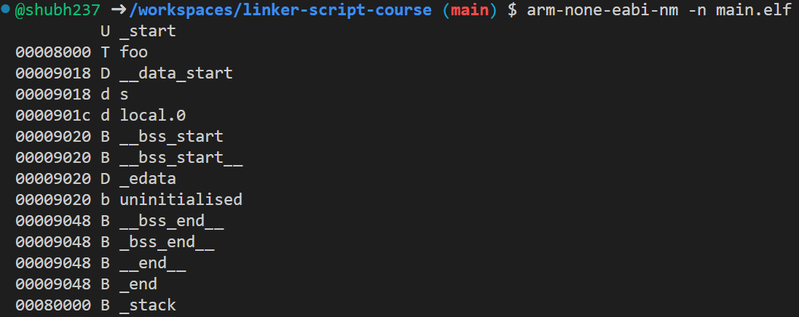

Have you ever wondered where your variables and functions are stored in memory and which sections they belong to? The 

arm-none-eabi-nm tool is a utility that allows you to look inside your program and find the exact memory addresses of your variables and functions.

<!--more-->


# Example

## Say we have:
```c
static int a=3;
static unintialised[10];

void foo(){
  static local=5;
}
```

### Build the code and run:

```bash
$ arm-none-eabi-nm -n <filename>.elf
```

### Will generate:


#### Column meanings

| Column | Meaning |
| :--- | :--- |
| **First Column** | Memory Address of the symbol. |
| **Second Column** | Symbol type. <br> - **T** stands for a symbol in the `.text` section (code/Flash).<br> - **D** is for a symbol in `.data` (initialized globals/statics in RAM). <br> - **d** is for a local symbol in `.data`.<br> - **B** is for symbol in `.bss` (uninitialized globals/statics in RAM). <br> - **b** is for a local symbol in `.bss`. <br> - **U** means the symbol is undefined (resolved elsewhere, usually in startup code). |
| **Third Column** | Symbol name. |


### Experiment to try

#### `arm-none-eabi-objdump`

A disassembler and object file inspector. 

#### `arm-none-eabi-readelf`

Used to view all headers. It can also display DWARF debugging information, which `objdump` cannot.
