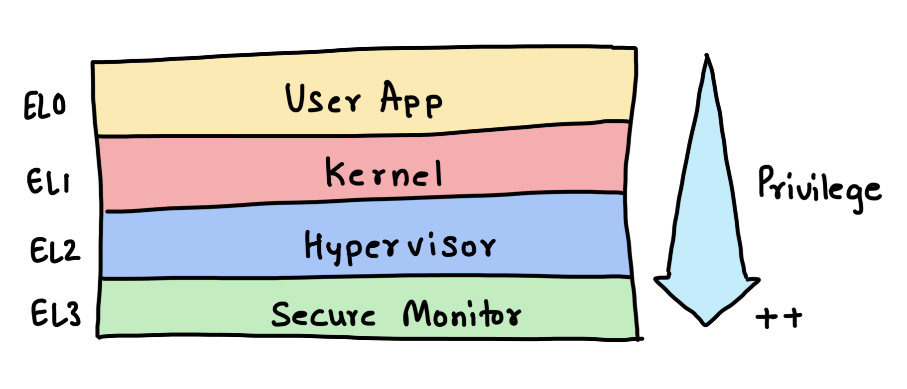
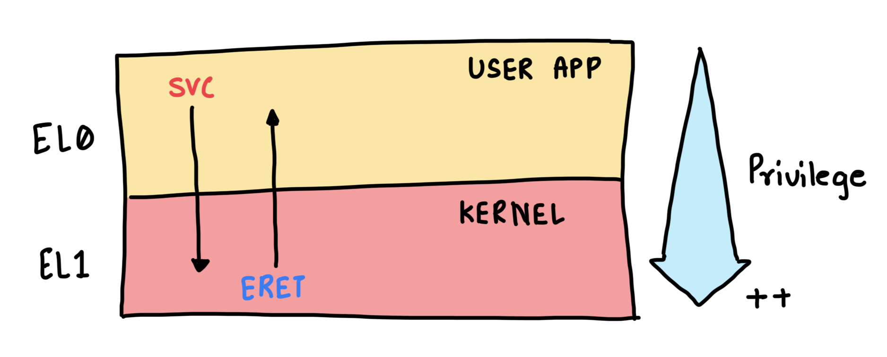
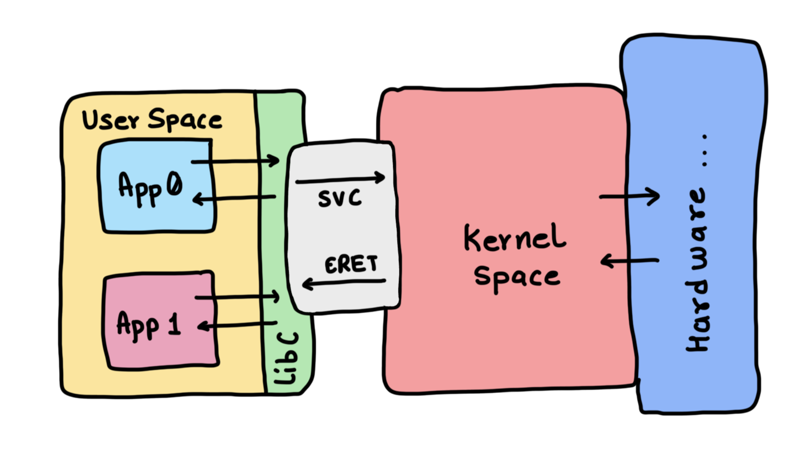

This note explains what a system call is, what you should imagine when trying to understand it and how you can design one.

<!--more-->

## The CPU - Privilege Levels

Before even talking about what a system/supervisor call is, you need to be clear about how the CPUs are these days (specifically the application grade - x86, ARM-A, RV64 etc).

The CPU (or core) can shutdown or limit access to some of its features depending on the mode it is operating in. This is by design.

What's a "mode" you ask?

Imagine the CPU providing certain features and instruciton execution only if a certain bit in its configuration registers (more about this below) is set. And that, this bit can be set or cleared when it is in a particular mode. This idea of modes is referred to as **privilege** levels.



The CPU start off in highest privilege level, the software it runs sets the stage and moves it to the lower pivilege level.

## The programmer's model of the CPU

CPUs provide a way to attend to external events formally referred to as `interrupts`/`expections`. Typically, interrupts refer to events that are coming from outside the CPU, like a peripheral request, and are asynchronous. **Expections** are internal and often a result of what the CPU is doing, like accessing a forbidden memory address. Exceptions are synchronus, i.e to say we can predict them.

> Exceptions are imporant to us.

The entry and exit to differnt modes is done using special instructions. These instructions are again, by design. There would be an instruction to induce an expection. And there would be one to return from an exception.

 on aarch64 architecture based CPUs.")

On **aarch64** architecture (CPU on raspberry pi 4B is based on this) these are `svc` and `eret` instruction. There are other instructions too, but we only care about these two at the moment.

As seen by the programmer, the CPU is a state-machine with the inputs, outputs and state information being saved in registers. We refer to these registers as General Purpose and Special Function (or Configuration) registers. And the fact that there are instructions the CPU can execute.

The General Purpose Registers (GPRs) are used for data manipulation while the Special Function (or Configuration) registers (SFRs/CFRs) are used to track the state of the CPU (things like what mode is it in, was a exception generated). Think of registers are a form of memory.

## So what are system calls?

You wouldn't want the user code or a random app to execute as privileged code. As a result, it executes with the CPU being the lowest privilege mode. The key here is, the user application can only execute the most basics of the instructions and can't reach or use the advance hardware capabilities. **If it wishes to, it must talk to the operating system (the kernel) components executing in the higher privilege**.



This is achieved by generating a software induced instruction and passing the details of the action in the GPRs. The software execption is generated by the user code executing the `SVC` instruction on the aarch64 machine as an example. What operation needs to be performed is conveyed as a numerical value in the GPR registers.

The control goes to the operating system (the kernel) as a result of the `svc` and it executes some piece of code (called the exception handler, more about it in detail [here](http://localhost:1313/posts/arm64-day2-irq-handling/)).

It is to be noted that the CPU hardware is aware of where to fetch the code from when the `svc` exception is induced. We call this code the `svc` exception handler and the CPU is updated with the location of this code during the boot up...

What you should bear in mind is, the `svc` handler is a piece of code that belongs to the operating system!

As part of the `svc` handler, the GPRs are read to infer the action the user code wants the OS to perform. Things like `open`, `read`, `write` etc each have a dedicated number that represents them. You can check the details of these numbers for the Linux Kernel in the [unistd.h](https://github.com/torvalds/linux/blob/v4.17/include/uapi/asm-generic/unistd.h#L205) file in the source.

Depending on what number was loaded in dedicated GPRs, the action and parameters are inferred. These numbers are agreed upon by the developer community and maintained as a standard. The numbers are called - `system call number`.

Again - The GPRs are used to pass the system call number, any inputs and to share the results between the user-code and the operating system. Check the System call table for arm64 here - https://arm64.syscall.sh/

The Kernel then executes the action on behalf of the User code. Along the way, it might run checks on the inputs to ensure the values are within expectations. This action usually involves interacting with the hardware, like doing reads and write on the storage etc. The Kernel uses the `eret` instruction to return the control back to the user code. The return value (or error code) is passed back as part of the GPRs.

## Hands-on Example

You can try the following code on **Raspberry Pi 4B**. In `main.S`, write the following assembly instructions. Here is what this code does:
1. demonstrate `write` and `exit` system calls.
1. `x0-x31` are CPU general purpose registers. `x0`-`x2` are used to pass the inputs if there are any. In this case, it's used to pass the address of the message and the length.
1. `x8` is loaded with `system call number`.
    1. **64** -- is for `write` system call.
    1. **93** -- is for `exit` system call.
1. `svc #0` triggers the software exception and changes the CPU privilege level.

```asm
.text
.global _start

_start:
    // Write System Call
    mov x0, #1          // File descriptor 1 (stdout)
    ldr x1, =msg        // Pointer to the string
    mov x2, #34         // Length of the string
    mov x8, #64         // System call number for 'write' (AArch64)
    svc #0              // Call the kernel

    // Exit System Call
    mov x0, #0          // Return code 0
    mov x8, #93         // System call number for 'exit'
    svc #0              // Call the kernel

.section .data
msg:
    .ascii "`write` system call printed this!\n"
```

You can assemble and execute the code with the following commands

```shell
$ as -o main.o main.S
$ ld -o main main.o
```

And then execute the final binary to see how the operating system responds. You should see something like below :)

```shell
$ ./hello
`write` system call printed this!
$
```

## So apps implement the syscalls?

No. The application code doesn't have to implement the system call code. Becuase these are standard and almost all application use these to talk to the kernel to get things done, the implementation is provided as part of the C library (referred to as `Lib C`).



**Lib C** exposes APIs that the user application can call and they internally implement the details of populating the CPU registers and issuing the Software exception. In the example we explored above, you can think of us having implemented some of the meat of these syscall APIs. Specifically `write()` and `exit()`

---
